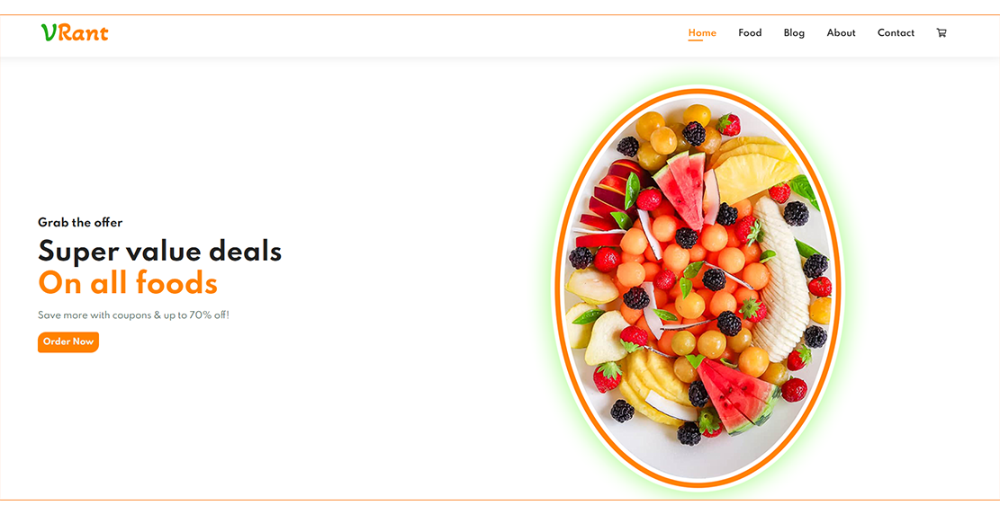

# VRant - Virtual Restaurant
VRant is a food ordering system where a user can order food and get the desired healthy food. People will get only healthy foods from this site. For example, fruits, fruit salad, vegetable salad, chicken soup, and so on. Fast food or any unhealthy food will not be available on this site. Using this web app, a user can get the feeling of a virtual restaurant. Nowadays, we can see many restaurants that provide various types of delicious food. But all the delicious foods are not healthy. We want to make a platform from where a person can get healthy foods. Sometimes, we can see that people want to follow a healthy diet but due to being busy all day long, they cannot prepare healthy foods for them and that's why they order some food that is available online and eat them. Our project will reduce this problem. We will help people to get healthy and nutritious foods through our website.

Website Link: [Click Here](https://vrant.000webhostapp.com/)

**A glimpse of our website is given below**

Home

Popular Orders

Search Food

## Team - Dynamic DUO
  * [Shumaiya Akter Shammi](https://github.com/Shammi179) 
  * [Sajal Das](https://github.com/sajaldas19)